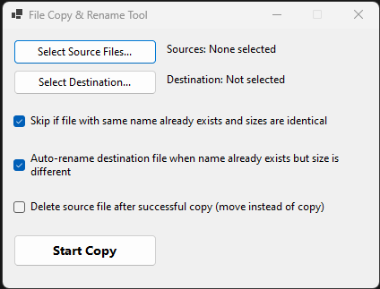

# FileCopyRenameTool

**File Copy & Rename Tool** — A simple but smart Windows utility for copying files with intelligent conflict handling.

## Features

- Select multiple source files and a destination folder
- Three smart copy modes:
  - **Skip** if a file with the same name already exists **and** the file sizes are identical
  - **Auto-rename** the destination file when a name conflict occurs but the size is different
  - **Move** mode: Delete the source file after a successful copy
- Clean and straightforward interface

## Current Version

**v1.0** (March 2026)

### Included Files

Located in the `v1.0/` folder:

- `FileCopyManager.exe` — Main executable
- Supporting .NET files (dll, runtime config, etc.)

## How to Use

1. Launch `FileCopyManager.exe`
2. Click **"Select Source Files..."** and choose one or more files
3. Click **"Select Destination..."** and choose the target folder
4. Choose your preferred options using the checkboxes:
   - Skip identical files
   - Auto-rename on name conflict (different size)
   - Move instead of copy
5. Click **"Start Copy"**

## Notes

- This is a published .NET application (self-contained).
- Source code is not included in this repository at the moment.

## Author

Created by **Orffyrus**.

## Related Projects

- [LOGSEQ](https://github.com/Orffyrus-Qc/LOGSEQ) – Logseq portable setup scripts
- [GAME](https://github.com/Orffyrus-Qc/GAME) – Collection of game server tools and utilities

---

If you have suggestions, bug reports, or would like to see the source code added, feel free to open an issue.
